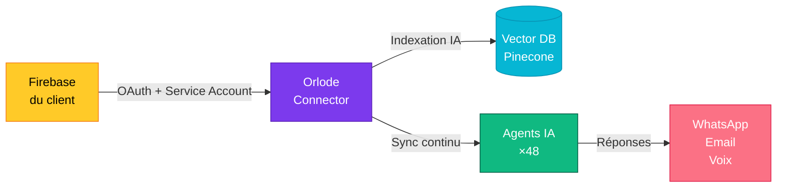

# Connecter <span class="italic-gold">Firebase</span> à Orlode

5 étapes · 3 minutes · Sync temps réel

<div class="abs-br m-6 flex gap-2">
  <span class="px-3 py-1 rounded-full text-xs font-bold" style="background: #FEF3C7; color: #B8860B;">
    OUIHOPE NGO · PREMIUM
  </span>
</div>

<style>
.italic-gold {
  font-family: 'Fraunces', serif;
  font-style: italic;
  font-weight: 500;
  background: linear-gradient(90deg, #D4A017, #B8860B);
  -webkit-background-clip: text;
  background-clip: text;
  color: transparent;
}
h1 {
  font-family: 'Fraunces', serif;
  font-weight: 700;
  letter-spacing: -0.02em;
}
</style>

---
layout: center
class: text-center
---

# Pourquoi <span class="italic-em">Firebase</span> ?

<v-clicks>

- **Sync temps réel** — vos agents voient la donnée à la milliseconde
- **Auth unifiée** — un seul login pour 25+ agents IA
- **Scalable** — Firestore tient 1M+ utilisateurs sans config
- **Stockage** — fichiers, images, audios indexés automatiquement

</v-clicks>

<style>
.italic-em { font-family: 'Fraunces', serif; font-style: italic; color: #0A4F3C; }
ul { font-size: 1.2rem; line-height: 2; }
</style>

---
layout: two-cols
---

# Architecture <span class="italic">cible</span>



::right::

# Ce qui est <span class="italic">indexé</span>

<v-clicks>

- 📦 **Firestore** — toutes les collections autorisées
- 📁 **Storage** — fichiers (PDF, images, audios)
- 👥 **Auth** — annuaire utilisateurs
- ⚡ **Realtime DB** — events temps réel
- 🔔 **Cloud Messaging** — notifications push

</v-clicks>

<style>
.italic { font-family: 'Fraunces', serif; font-style: italic; color: #D4A017; }
</style>

---
layout: section
---

# Les <span class="italic-step">5 étapes</span>

<style>
.italic-step {
  font-family: 'Fraunces', serif;
  font-style: italic;
  background: linear-gradient(90deg, #7C3AED, #06B6D4);
  -webkit-background-clip: text;
  color: transparent;
}
</style>

---
transition: slide-up
---

# Étape <span class="step-num">1</span> — Créer un Service Account

<div class="grid grid-cols-2 gap-8 mt-8">

<div>

<v-clicks>

1. Aller sur **console.firebase.google.com**
2. Sélectionner votre projet
3. ⚙️ **Paramètres → Comptes de service**
4. Cliquer **"Générer une nouvelle clé privée"**
5. Télécharger le fichier `.json`

</v-clicks>

</div>

<div>

```json {2,3,5|all}
{
  "type": "service_account",
  "project_id": "your-project",
  "private_key_id": "...",
  "private_key": "-----BEGIN...-----",
  "client_email": "firebase-adminsdk@...",
  "client_id": "..."
}
```

<div v-click class="mt-4 p-3 rounded-lg" style="background: #FEE2E2; border: 1px solid #DC2626;">
  ⚠️ <strong>Garde ce fichier secret.</strong> Ne jamais le committer dans Git.
</div>

</div>

</div>

<style>
.step-num {
  font-family: 'Fraunces', serif;
  font-style: italic;
  color: #D4A017;
  font-size: 1.3em;
}
ol { font-size: 1.1rem; line-height: 2; }
</style>

---
transition: slide-up
---

# Étape <span class="step-num">2</span> — Configurer les permissions

<div class="grid grid-cols-3 gap-4 mt-8">

<div v-click class="card">
  <div class="card-icon" style="background: #DBEAFE; color: #1E40AF;">📖</div>
  <h3>Lecture seule</h3>
  <p>Recommandé pour démarrer. Orlode lit, n'écrit jamais.</p>
  <div class="badge" style="background: #D1FAE5; color: #065F46;">SAFE</div>
</div>

<div v-click class="card">
  <div class="card-icon" style="background: #F3E8FF; color: #5B21B6;">✏️</div>
  <h3>Lecture + écriture</h3>
  <p>Pour agents qui créent (ex: drafts, leads, événements).</p>
  <div class="badge" style="background: #FEF3C7; color: #B8860B;">CONTRÔLÉ</div>
</div>

<div v-click class="card">
  <div class="card-icon" style="background: #FEE2E2; color: #B91C1C;">🛠️</div>
  <h3>Admin complet</h3>
  <p>Tout. Réservé aux super-admins entreprise.</p>
  <div class="badge" style="background: #FEE2E2; color: #DC2626;">DANGER</div>
</div>

</div>

<div v-click class="mt-8 text-center text-sm" style="color: #5A6B62;">
  → Tu pourras affiner par collection dans l'étape 4
</div>

<style>
.step-num { font-family: 'Fraunces', serif; font-style: italic; color: #D4A017; font-size: 1.3em; }
.card {
  background: #FFFAF0;
  border: 1px solid rgba(10,42,32,0.08);
  border-radius: 14px;
  padding: 1.5rem;
  text-align: center;
  box-shadow: 0 4px 12px -4px rgba(0,0,0,0.05);
}
.card-icon {
  width: 56px; height: 56px;
  border-radius: 14px;
  display: flex; align-items: center; justify-content: center;
  font-size: 1.8rem;
  margin: 0 auto 1rem;
}
.card h3 {
  font-family: 'Fraunces', serif;
  font-weight: 700;
  margin-bottom: 0.5rem;
  color: #0A2A20;
}
.card p { font-size: 0.85rem; color: #5A6B62; min-height: 60px; }
.badge {
  display: inline-block;
  padding: 4px 10px;
  border-radius: 100px;
  font-size: 10px;
  font-weight: 700;
  letter-spacing: 0.05em;
  margin-top: 0.5rem;
}
</style>

---
transition: slide-up
---

# Étape <span class="step-num">3</span> — Coller la clé dans Orlode

<div class="grid grid-cols-2 gap-6 mt-6">

<div>

<v-clicks>

1. Ouvrir **orlode.ai** → **Modules → Connecteurs**
2. Cliquer sur la carte **Firebase**
3. Coller le contenu du `.json`
4. Choisir le scope (Lecture / Lect-Écr / Admin)
5. Tester la connexion → ✓

</v-clicks>

</div>

<div v-click>

<div class="screenshot">
  <div class="ss-header">
    <div class="ss-logo" style="background: #FFF8E1; color: #FFCA28;">F</div>
    <div>
      <div class="ss-title">Firebase</div>
      <div class="ss-cat">● Données</div>
    </div>
  </div>
  <textarea class="ss-textarea" readonly>{
  "type": "service_account",
  "project_id": "ouihope-prod",
  ...
}</textarea>
  <button class="ss-btn">→ Tester la connexion</button>
</div>

</div>

</div>

<style>
.step-num { font-family: 'Fraunces', serif; font-style: italic; color: #D4A017; font-size: 1.3em; }
.screenshot {
  background: #FFFAF0;
  border: 1.5px solid #10B981;
  border-radius: 14px;
  padding: 16px;
  font-size: 0.85rem;
  box-shadow: 0 12px 28px -8px rgba(124,58,237,0.2);
}
.ss-header { display: flex; align-items: center; gap: 12px; margin-bottom: 12px; }
.ss-logo {
  width: 44px; height: 44px;
  border-radius: 11px;
  display: flex; align-items: center; justify-content: center;
  font-weight: 800; font-size: 22px;
  font-family: 'Fraunces', serif;
}
.ss-title { font-family: 'Fraunces', serif; font-weight: 700; color: #0A2A20; }
.ss-cat { font-size: 0.7rem; color: #4338CA; font-weight: 600; }
.ss-textarea {
  width: 100%; height: 100px;
  font-family: 'JetBrains Mono', monospace;
  font-size: 0.7rem;
  background: #F5EDD6;
  border: 1px solid rgba(10,42,32,0.08);
  border-radius: 8px;
  padding: 8px;
  color: #0A2A20;
  resize: none;
}
.ss-btn {
  width: 100%;
  background: linear-gradient(135deg, #FFCA28, #F57F17);
  color: #1F2937;
  border: none;
  border-radius: 8px;
  padding: 10px;
  font-weight: 700;
  margin-top: 10px;
  cursor: pointer;
}
</style>

---
transition: slide-up
---

# Étape <span class="step-num">4</span> — Sélectionner les collections

<div class="mt-6 mb-4 text-sm" style="color: #5A6B62;">
  Orlode liste toutes vos collections. Cochez ce que vos agents doivent voir.
</div>

<div class="collections grid grid-cols-2 gap-2">

<div v-click="1" class="coll selected">
  <input type="checkbox" checked /> <strong>users</strong>
  <span class="coll-meta">12 478 docs</span>
</div>

<div v-click="2" class="coll selected">
  <input type="checkbox" checked /> <strong>customers</strong>
  <span class="coll-meta">3 421 docs</span>
</div>

<div v-click="3" class="coll selected">
  <input type="checkbox" checked /> <strong>orders</strong>
  <span class="coll-meta">8 812 docs</span>
</div>

<div v-click="4" class="coll">
  <input type="checkbox" /> <strong>logs</strong>
  <span class="coll-meta">240 K docs · skip</span>
</div>

<div v-click="5" class="coll selected">
  <input type="checkbox" checked /> <strong>products</strong>
  <span class="coll-meta">512 docs</span>
</div>

<div v-click="6" class="coll">
  <input type="checkbox" /> <strong>_internal</strong>
  <span class="coll-meta">privé · skip</span>
</div>

</div>

<div v-click="7" class="mt-6 text-sm flex items-center gap-2" style="color: #065F46;">
  <span style="width: 8px; height: 8px; border-radius: 50%; background: #10B981; display: inline-block;"></span>
  4 collections · 25 223 documents seront indexés
</div>

<style>
.step-num { font-family: 'Fraunces', serif; font-style: italic; color: #D4A017; font-size: 1.3em; }
.coll {
  background: #FFFAF0;
  border: 1.5px solid rgba(10,42,32,0.08);
  border-radius: 10px;
  padding: 12px 14px;
  display: flex; align-items: center; gap: 10px;
  font-size: 0.95rem;
  transition: all 0.2s ease;
}
.coll.selected { border-color: #10B981; background: #ECFDF5; }
.coll-meta { margin-left: auto; font-size: 0.75rem; color: #5A6B62; font-family: 'JetBrains Mono', monospace; }
.coll input { accent-color: #10B981; }
</style>

---
transition: slide-up
---

# Étape <span class="step-num">5</span> — Activer la sync

<div class="grid grid-cols-3 gap-3 mt-6">

<div v-click class="schedule">
  <div class="schedule-icon" style="background: #F3E8FF; color: #5B21B6;">⚡</div>
  <h4>Temps réel</h4>
  <p>Sync à la milliseconde via Firestore listeners</p>
  <div class="schedule-tag" style="background: #F3E8FF; color: #5B21B6;">RECOMMANDÉ</div>
</div>

<div v-click class="schedule">
  <div class="schedule-icon" style="background: #DBEAFE; color: #1E40AF;">⏱️</div>
  <h4>Toutes les heures</h4>
  <p>Pour datasets stables où le delta horaire suffit</p>
  <div class="schedule-tag" style="background: #DBEAFE; color: #1E40AF;">ÉCO</div>
</div>

<div v-click class="schedule">
  <div class="schedule-icon" style="background: #FEF3C7; color: #B8860B;">🌙</div>
  <h4>Quotidien (3h du matin)</h4>
  <p>Pour archives, logs, datasets froids</p>
  <div class="schedule-tag" style="background: #FEF3C7; color: #B8860B;">BUDGET</div>
</div>

</div>

<div v-click class="mt-8 final-cta">
  <div class="final-icon">✓</div>
  <div>
    <h3>Firebase connecté !</h3>
    <p>L'indexation initiale prend ~2 min pour 25 K documents.<br/>Vos 48 agents auront accès dès la fin du sync.</p>
  </div>
</div>

<style>
.step-num { font-family: 'Fraunces', serif; font-style: italic; color: #D4A017; font-size: 1.3em; }
.schedule {
  background: #FFFAF0;
  border: 1.5px solid rgba(10,42,32,0.08);
  border-radius: 14px;
  padding: 1.2rem;
  text-align: center;
}
.schedule-icon {
  width: 50px; height: 50px;
  border-radius: 12px;
  display: flex; align-items: center; justify-content: center;
  font-size: 1.5rem;
  margin: 0 auto 0.8rem;
}
.schedule h4 {
  font-family: 'Fraunces', serif;
  font-weight: 700;
  font-size: 1rem;
  color: #0A2A20;
  margin-bottom: 0.4rem;
}
.schedule p { font-size: 0.78rem; color: #5A6B62; min-height: 50px; line-height: 1.5; }
.schedule-tag {
  display: inline-block;
  padding: 4px 10px;
  border-radius: 100px;
  font-size: 9px;
  font-weight: 700;
  letter-spacing: 0.05em;
  margin-top: 0.4rem;
}
.final-cta {
  display: flex;
  align-items: center;
  gap: 1.5rem;
  background: linear-gradient(135deg, #FFFAF0, #F5EDD6);
  border: 1.5px solid #10B981;
  border-radius: 18px;
  padding: 1.5rem;
  box-shadow: 0 12px 28px -8px rgba(16,185,129,0.3);
}
.final-icon {
  width: 60px; height: 60px;
  border-radius: 50%;
  background: linear-gradient(135deg, #10B981, #065F46);
  color: #FFFAF0;
  display: flex; align-items: center; justify-content: center;
  font-size: 1.8rem;
  flex-shrink: 0;
}
.final-cta h3 {
  font-family: 'Fraunces', serif;
  font-weight: 800;
  font-size: 1.3rem;
  color: #065F46;
}
.final-cta p { font-size: 0.85rem; color: #0A4F3C; margin-top: 0.3rem; line-height: 1.5; }
</style>

---
layout: center
class: text-center
---

# <span class="italic-em">Bravo</span>, c'est fait.

<div class="mt-6 text-xl" style="color: #5A6B62;">
  Vos agents IA ont maintenant accès à Firebase en temps réel.
</div>

<div class="mt-12 flex justify-center gap-3">

<div v-click class="next">
  <div class="next-num">1</div>
  <div>Tester un agent avec une question sur vos données</div>
</div>

<div v-click class="next">
  <div class="next-num">2</div>
  <div>Configurer un autre connecteur (Gmail, Slack, ...)</div>
</div>

<div v-click class="next">
  <div class="next-num">3</div>
  <div>Inviter votre équipe sur orlode.ai</div>
</div>

</div>

<div class="abs-b mb-8 text-sm" style="color: #94A3A0;">
  Besoin d'aide ? <strong style="color: #D4A017;">support@orlode.ai</strong>
</div>

<style>
h1 { font-family: 'Fraunces', serif; font-weight: 800; }
.italic-em {
  font-style: italic; font-weight: 500;
  background: linear-gradient(90deg, #D4A017, #B8860B);
  -webkit-background-clip: text;
  color: transparent;
}
.next {
  background: #FFFAF0;
  border: 1.5px solid rgba(10,42,32,0.08);
  border-radius: 14px;
  padding: 1rem 1.4rem;
  display: flex; align-items: center; gap: 0.8rem;
  text-align: left;
  font-size: 0.95rem;
  box-shadow: 0 4px 12px -4px rgba(0,0,0,0.05);
}
.next-num {
  width: 32px; height: 32px;
  border-radius: 50%;
  background: linear-gradient(135deg, #7C3AED, #5B21B6);
  color: #FFFAF0;
  display: flex; align-items: center; justify-content: center;
  font-weight: 800;
  font-family: 'JetBrains Mono', monospace;
  flex-shrink: 0;
}
</style>

---
layout: end
---

# <span class="italic">orlode</span>.ai

Une plateforme. 48 agents. Toute l'Afrique.

<style>
h1 {
  font-family: 'Fraunces', serif;
  font-weight: 800;
  font-size: 4rem;
  background: linear-gradient(135deg, #0A4F3C, #D4A017, #7C3AED);
  -webkit-background-clip: text;
  color: transparent;
}
.italic { font-style: italic; }
</style>
